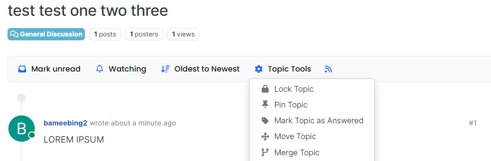

User Guide for Search Replies by Keyword Feature

Introduction
This adds a placeholder search bar to discussion topics so that we can search 
replies by keyword. It's placed in the same location as search bars on other pages 
for consistency.

How to Use the Feature
Currently, this is only the front-end design so the search functionality cannot be 
tested.

Link/Description
The file path is nodebb-theme-harmony/templates/topic.tpl and lines 29 - 36 create 
and format the search bar.
=======
# User Guide for Marking Questions as "Good"

In test/goodQuestion.js, you are able to run a test that checks that, when clicking the Green Check-Mark next to the upvote
button on any particular post, it is marked as a "Good Question" by NodeBB. This test is sufficient for covering the change I made
as this is the only feature implemented; I did not work on "un-voting" or any other feature.

# User Guide for Categorizing Topics as "Answered/Unanswered"

To use this feature, navigate to a topic and select "Topic Tools."

There should be a button within to dropdown menu to mark the topic as "answered."

The automated tests for this can be found in test/answered.js. The tests create and categorize topics as answered and unanswered, and assure that they are valid topics. This is sufficient for the features I implemented, as there are no feature to interact with these new categories yet.

# User Guide for Search Functionality

## Overview

This guide provides instructions on how to use the search functionality within the application. The search feature allows users to find topics, posts, and other content efficiently.

## Global Search

The global search function is located on the right sidebar of the dashboard. You can initiate a search by entering your query in the search input field and pressing the enter key:

When you click the search icon, the search bar will appear:

After entering the keywords, the search result will show:

## Topic Search

The topic search function is located in the topic header section of the application. You can initiate a search by entering your query in the search input field and pressing the search button.

The search bar on the category page:

When you search on the category page, the result will only show within the specific category:

## Search Parameters

- **Category**: Filter results by specific category.
- **Tags**: Filter results by specific tags.
- **Posted by**: Filter results by specific user.
- **Time Range**: Specify a time range for the content.
- **Sort By**: Sort results by relevance, date, or other criteria.
- **Replies**: Filter results based on the number of replies.
- **Saved**: Filter results by saved posts.

## Search Results

The results of your search will be displayed with pagination, allowing you to navigate through multiple pages of results if necessary. Each result will include relevant information based on your search parameters.

## Test
The path of the test file is `test/search.js`

Test Descriptions
1. Search Topics Under Specific Categories
Purpose: To verify that the search functionality can accurately find topics within specific categories.
2. Search for Multiple Categories
3. Return Empty Results for Non-Existent Category
Purpose: To confirm that the search returns no results when searching for a non-existent category.

Since the new feature is to do search topics on the categories page, it is important to ensure the reliability and correctness when doing search for topics by categories. So I added those new tests to ensure the search function could run properly.

## Troubleshooting

If you encounter issues with the search functionality, consider the following:

- Ensure your query is correctly formatted.
- Check your user privileges for any restrictions.
- Verify that the search parameters are set correctly.

For further assistance, please contact support or refer to the application's help resources.

## Conclusion

The search functionality is a powerful tool for navigating and finding content within the application. By understanding and utilizing the available parameters and filters, you can efficiently locate the information you need.
